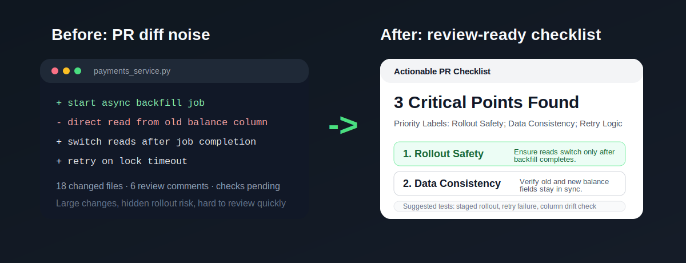
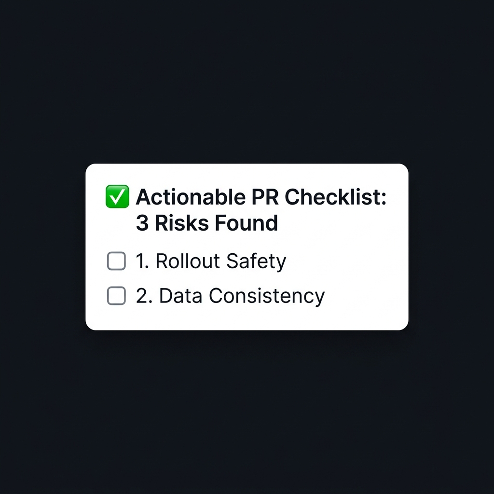

# GitHub PR Checklist

<p align="center">
  
</p>

<p align="center">
  <strong>Turn pull requests into an actionable review checklist.</strong><br>
  A focused GitHub workflow tool for reviewers who want signal, not summary theater.
</p>

<p align="center">
  <a href="#install"><strong>Install</strong></a> |
  <a href="#usage"><strong>Usage</strong></a> |
  <a href="#scenario-case-studies"><strong>Scenarios</strong></a>
</p>

---

## Requirements

GitHub PR Checklist is a Codex skill.

- Live PR review from a PR URL or `owner/repo#number` requires GitHub connector access in the host environment.
- If connector access is unavailable, the skill still works with pasted `diff` or `patch` input.

## Why this exists

Modern PR review is noisy. Most automated summaries simply retell the diff and add more reading to a process that already has too much of it.

GitHub PR Checklist is built for the next decision:

- **Review faster** by focusing on behavior changes instead of line-by-line narration
- **Miss fewer risky changes** by surfacing rollout, state, and edge-case concerns
- **Avoid fluffy summaries** by keeping every section tied to an action or verification step

## Who this is for

- Engineers who review pull requests every day and want faster approval decisions
- Founders and small teams who need better review signal without adding heavy process
- Open-source maintainers triaging large or noisy pull requests
- Anyone who has felt that PR summaries explained the patch without helping the review

## Why this beats PR diff summaries

Typical PR summaries stop at "what changed."

This project is optimized for "what should I do next?"

- It prioritizes risk over retelling the diff
- It pulls unresolved reviewer concerns into the checklist
- It suggests concrete tests instead of generic reassurance
- It stays compact enough to scan before approving or requesting changes

## The Transformation

### From diff noise

Large PRs bury signal inside changed files, unresolved comments, and check results.

### To decision-ready output

The tool turns that PR context into a compact checklist:

```md
## Actionable PR Checklist
- Critical Points Found: 2
- Priority Labels: Rollout Safety; Auth Regression

## Key Changes
- Refactors auth middleware to initialize a secure request context.

## Risks
1. Rollout Safety: deployment order may matter if the database migration has not landed before deploy.
2. Auth Regression: the new failure path could leak privileged behavior if admin checks are incomplete.

## Questions
- Does this change require new environment variables or secret rotation?

## Suggested Tests
- Verify admin privilege elevation in staging.
- Exercise the new request context under concurrency.
```

## Before and After

### Before

```txt
18 changed files
6 review comments
checks pending

- switched reads to the new balance column
- added an async backfill job
- touched retry logic and admin-only flows

Need to review:
- whether rollout order matters
- whether the new and old columns can drift
- whether retries could duplicate writes
```

### After

```md
## Actionable PR Checklist
- Critical Points Found: 3
- Priority Labels: Rollout Safety; Data Consistency; Retry Logic

## Key Changes
- Adds an async backfill job for the new balance column.
- Switches reads from the old field to the new field after migration.
- Updates retry behavior around lock timeouts.

## Risks
1. Rollout Safety: reads may switch before the backfill is complete.
2. Data Consistency: old and new balance fields could drift during rollout.
3. Retry Logic: lock-timeout retries may replay writes unexpectedly.

## Suggested Tests
- Run a staged rollout with partial backfill completion.
- Compare old and new balance fields before and after retry paths.
```

## Scenario Case Studies

### 1. Backend and infrastructure migration

**PR scope**: adding columns, backfilling jobs, switching read paths.  
**Checklist focus**: rollout safety, data consistency, and rollback procedures.

### 2. Frontend auth refactor

**PR scope**: moving auth checks into shared hooks and changing redirect behavior.  
**Checklist focus**: hidden regressions, session expiry edge cases, and manual verification steps.

### 3. Review-heavy PR

**PR scope**: checks are green, but the review thread is crowded with unresolved comments.  
**Checklist focus**: condensing reviewer concerns into the next small set of actions.

## What it reads

When GitHub connector access is available, the tool uses:

- PR metadata
- changed files and diff
- review comments
- check status

If direct access is unavailable, it falls back to a pasted diff or patch and preserves the same output contract.

## Install

Copy the skill folder into your Codex skills directory:

```bash
$CODEX_HOME/skills/github-pr-checklist
~/.codex/skills/github-pr-checklist
```

The directory to copy is `skills/github-pr-checklist`.
To review a live pull request from a URL or PR identifier, the host environment also needs GitHub connector access.

## Usage

```txt
Use $github-pr-checklist on https://github.com/acme/api/pull/481.

Use $github-pr-checklist on acme/web#912 and focus on approval blockers.

Use $github-pr-checklist on this diff and include a short reply draft.
```

## Repository Layout

```txt
skills/github-pr-checklist/
  SKILL.md
  agents/openai.yaml
  references/

docs/assets/
  demo-before-after.svg
  social-preview.png
```

---

<p align="center">
  
</p>

<p align="center">
  Built for engineers who value signal over noise.
</p>
